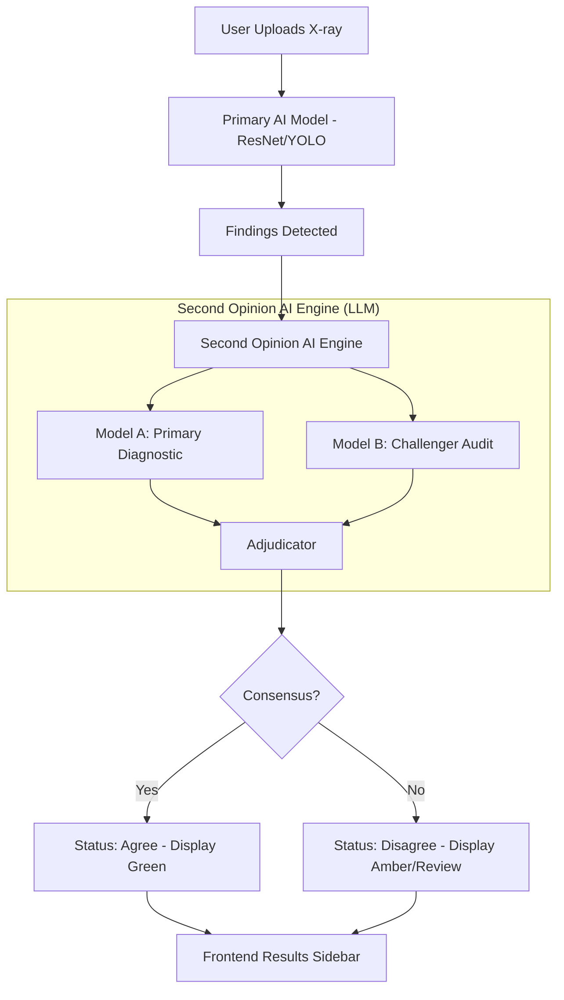

# 🏗️ System Architecture: Second Opinion AI

## 📊 High-Level Data Flow

## 🔄 Request/Response Lifecycle
1. **Trigger**: Backend receives a batch of findings from the vision model.
2. **Analysis**: For each high-priority finding, a `SecondOpinionAI` request is dispatched.
3. **Synthesis**: The adjudicator determines the consensus.
4. **Delivery**: The finding object is augmented with `second_opinion: "agree" | "disagree"`.

## 💾 Database Strategy
The `findings` table should include the following fields:
- `second_opinion_status`: VARCHAR ('pending', 'agree', 'disagree')
- `second_opinion_notes`: TEXT (The clinical reasoning from the adjudicator)
- `second_opinion_timestamp`: TIMESTAMPTZ

## 📱 Frontend Display Mockups
- **Consensus View**: A small green "Verified" badge next to the finding.
- **Review View**: A pulsating amber "Review Required" banner inside the finding card.
- **Side-by-Side**: A "Compare AI Views" tab in the dentist dashboard showing the subtle differences in reasoning.

## 📈 Success Metrics
- **Consensus Rate**: Percentage of scans where models agree (Target: >85%).
- **Clinical Catch Rate**: Number of times 'disagree' led a human dentist to change the diagnosis.
- **System Latency**: Time from scan finish to Second Opinion completion (Target: <4s).
